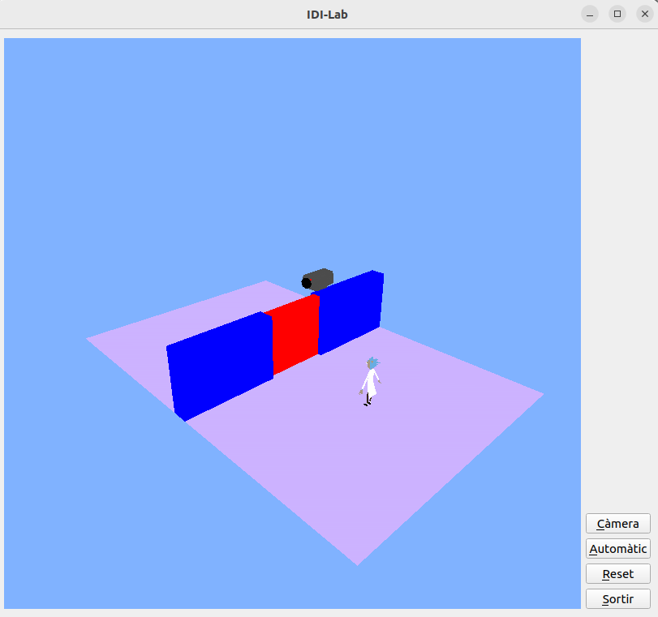
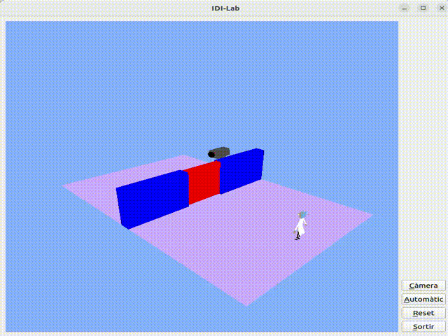

# INDI-Act2-2425Q2
A Qt + OpenGL 3D interactive scene for Rick movement, camera control, and animated door logic. Created for the INDI course (EPSEVG - UPC, 2024–2025 Q2).

The project features camera control, model rendering, animation, and GUI interaction. It allows user interaction with a character (Rick), a dynamic red door, and camera perspectives in a fully navigable scene.

## 🚀 Features

- ✅ **Third-person camera** with Euler angle control via mouse.
- 🎮 **Free/fixed camera toggle** (fixed camera simulates a security camera).
- 🧍 **Rick character movement** with keyboard and automatic mode.
- 🚪 **Sliding red door** opens/closes smoothly when Rick is nearby.
- 🖱 **Mouse input** for intuitive scene inspection.
- 🧩 **Qt GUI interface** with buttons to toggle camera and auto-movement.
- 🌍 Full 3D environment: walls, floor, models, and real-time rendering.

## 🎮 Controls

| Action                     | Input                   |
|----------------------------|-------------------------|
| Move Rick forward          | `↑` (Arrow Up)          |
| Move Rick backward         | `↓` (Arrow Down)        |
| Toggle fixed camera        | `C` key or button       |
| Toggle auto movement       | `A` key or button       |
| Reset scene                | `R` key or button       |
| Rotate view (free camera)  | Left-click + Mouse drag |

## 🧱 Project Structure
```
INDI-Act2-2425Q2/
├── Statement.pdf
├── Model/
│   ├── model.cpp
│   └── model.h
├── models/
│   ├── Rick.mtl
│   └── VideoCamera.mtl
├── shaders/
│   ├── basicShader.frag
│   └── basicShader.vert
├── MyGLWidget.cpp
├── MyGLWidget.h
├── BL2GLWidget.cpp
├── BL2GLWidget.h
├── main.cpp
├── MyForm.cpp
├── MyForm.h
├── MyForm.ui
├── Exercici-2.pro
├── README.md
└── media/
    ├── screenshot.png
    └── demo.gif
```

## 🖥 Requirements

- Qt 5 or higher
- OpenGL 3.3+
- CMake (or use Qt Creator for convenience)

## 📸 Screenshots





## 📘 Academic Context

Developed as part of:
**INDI - Interacció i disseny d'interfícies**  
Degree: Computer Science  
University: Escola Politècnica Superior d'Enginyeria de Vilanova i la Geltrú (EPSEVG - UPC)  
Course term: **2024–2025 Q2**  
Mark: 10
